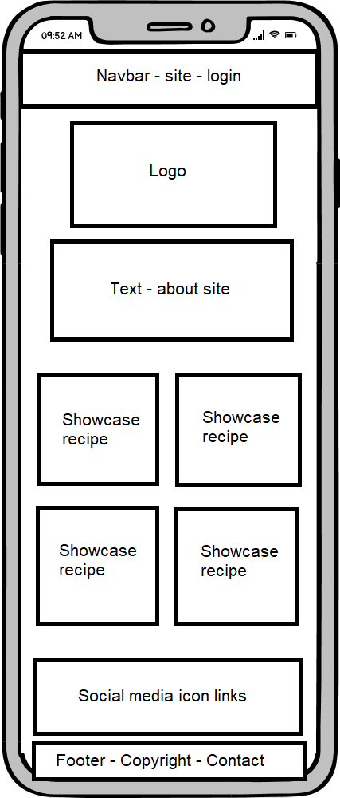

# Milestone Project 3
# Tanya Allen
## OMG It's Happy Hour! 

About

Mockups 

Live version

### Table of content:
1. User experience
  * User stories 
2. Design
  * Wireframes
  * Designs
  

User experience

User stories 

First time users:

As a first time user of the site, I want to be able to be able to create an account.
As a first time user of the site, I want to be able to upload my recipe.
As a first time user of the site, I want to be able to find a recipe to use.
As a first time user of the site, I want to be inspired to make something.

Returning users:

As a first returning user of the site, I want to be able to log in to my account.
As a first returning user of the site, I want to be able to find my recipes.
As a first returning user of the site, I want to be able to edit my recipes.
As a first returning user of the site, I want to be able to delete my recipes.

Site owners: 

As the site owner, I want the site to be attractive and eye catching.
As the site owner, I want people to create an account.
As the site owner, I want the site content to be readable on all devices.
As the site owner, I want the site to be accessible to all potential customers.

Design

Wireframes

Index page

![wireframepad] (../docs/imgs/indexwireframe2.png)

![wireframedesktop] (../docs/imgs/indexwireframe3.png)

Colourscheme

